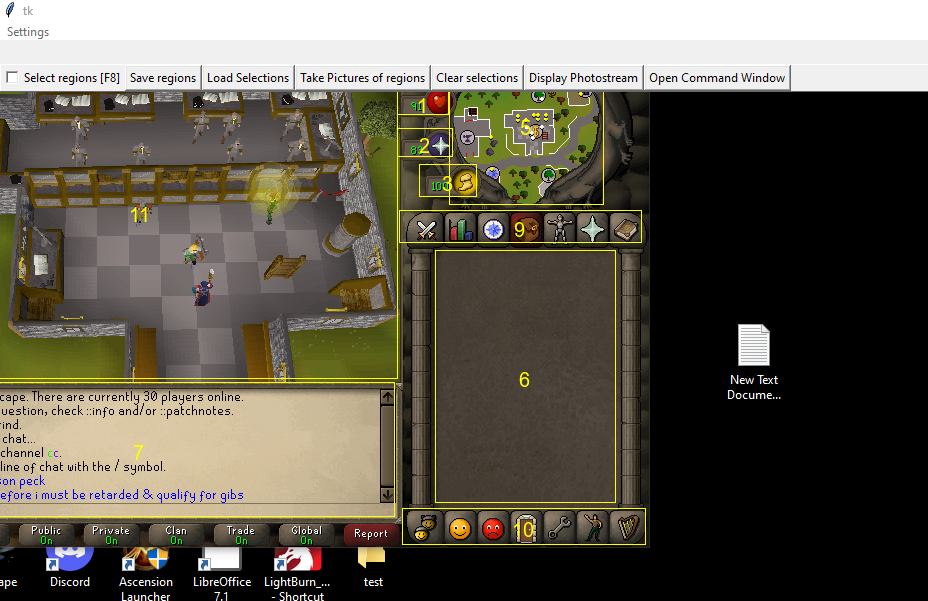
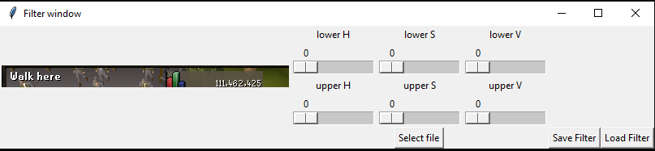

Welcome to the (hopefully) next generation automation tool, MLIP! MLIP is the answer to game specific botting platforms, difficult to use macro programs, and game developers that are looking to add a... creative solution to their testing arsenal.
MLIP is a generalized automation tool that either the user, or the program itself, can train to perform a specific task. It is multi-platform, meaning it can run on windows and unix, is written in python, and interacts with the machine in the same way any user would: it visually looks at what is going on with the screen, and uses the mouse and keyboard to interact with things on the screen. 

Completed: 
cross-platform interface that can grab the screen, allow the user to define regions of interest, store pictures of these for later training, create filters on those pictures to allow either OCR(to be implemented) or a comparison algorithm(to be chosen and implemented) using opencv to begin a basis for logic.

To-do:
Figure out a name for the program
OCR on images
    We have simpleocrex.py, we are looking to incorporate this into something like ocrreader.py

Do image-to-image comparison (maybe implement the following, we have an example on how to do this in imagecompare.py)
    Methodology: We check if left-text-box says Walk Here. If it does, do not save image. If it is empty, do not save image. if similarity is >95, we can be fairly certain that the image contains the main string we are looking for (EG: "Walk Here" vs "Walk Here /6 more options" returns above 95% similar)

What is the program, what problem does it solve, how does it solve it.
Features

Active bugs: 
Solved bugs: when in the Filter window screen, the image will not dynamically update as the sliders move around. The filter will only be applied to the image after selecting a new file.

Useful commands learned: git diff HEAD~5 HEAD (5 is 5 git revisions ago)
git all "Message goes here!"